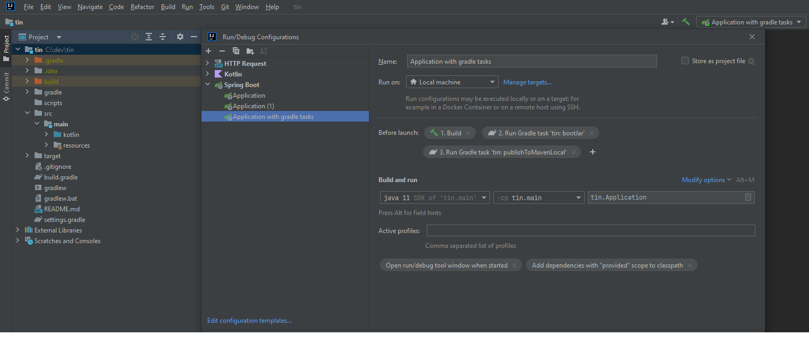

# TinDL
An Engine for Answering Approximate Regular Path Queries over ELH and ELHI Ontologies.

This is a Kotlin implementation, using Spring Boot and a backend MySQL DB. OWLAPI 5.5.0 is used to handle ontologies.

---
### Dependencies

The following dependencies are used in the project:
- Spring Boot 3.3.0
- Gradle 8.12.1
- [OWLAPI 5.5.0](https://github.com/owlcs/owlapi)
- [Hermit Reasoner 1.4.5.519](http://www.hermit-reasoner.com/)
- [ELK Reasoner 0.6.0](https://github.com/liveontologies/elk-reasoner)
- [OWL2VOWL 0.3.1](https://github.com/VisualDataWeb/OWL2VOWL)

---
## Installation
### Deploy using Docker

The Dockerfile and docker-compose.yml included in this repo can be used to quickly deploy the application.

### Steps:
1. Clone the repository (make sure you have appropriate access rights)\
```
git clone git@gitlab.tcs.inf.tu-dresden.de:s8880157/tin.git
cd tin
```
2. Create a file ```src/main/resources/application.properties``` by copying [```src/main/resources/application.default.properties```](-/blob/main/src/main/resources/application.default.properties) and adjust it to your setup:\
```
cp src/resources/application.default.properties src/resources/application.properties
```

3. Start the containers:
```
docker compose up -d
```
The TinDL backend will be available at ```localhost:8900```.

---

### Development setup
Requirements:
- Gradle 8.12.1
- JVM 17 or later

### Steps:
1. Clone the repository (make sure you have appropriate access rights)\
```
git clone git@gitlab.tcs.inf.tu-dresden.de:s8880157/tin.git
cd tin
```
2. Create a file ```src/main/resources/application.properties``` by copying [```src/main/resources/application.default.properties```](-/blob/main/src/main/resources/application.default.properties) and adjust it to your setup:\
```
cp src/resources/application.default.properties src/resources/application.properties
```
3. Make sure you have Redis and a MySQL DB up and running, and set up your ```application.properties``` accordingly.\
If you want to run these with docker, take a look at the provided ```docker-compose.development.yml```
4. Use Gradle to build the project (Make sure gradle is available at the path, see https://github.com/gradle/gradle for installation)
```
gradle build
```
The tests included in the repo require a long time to execute and might fail if not enough memory is available. If you want to skip the tests, use
```
gradle build -x test
```
To build the .jar, use 
```
gradle bootJar
```
And finally run the jar using your JVM.

It is recommended to setup your IDE to automatically run these steps. Look at the following example setup for IntelliJ 
<details>
<summary>Click to expand</summary>
   Note: You may exclude the gradle tasks bootJar and publishToMavenLocal from this, but be sure to run these tasks whenever you changed Controllers or DataClasses (else the Typescript Generator will fail due to an outdated jar file)!



</details>

---
## Usage

TinDL exposes a REST-API to upload files, run tasks and retrieve results. The API is documented here.


## Contact

Author: Tom Ziegler
mail: tom.ziegler1@mailbox.tu-dresden.de

## Background

This is a prototype implementation obtained during a diploma thesis at the Chair of Automata Theory, TU Dresden.\
Relevant publications:
- Fernández Gil, Turhan: Answering Regular Path Queries Under Approximate Semantics in Lightweight Description Logics, https://lat.inf.tu-dresden.de/research/papers/2021/FeAt-AAAI-21.pdf
- Bienvenu, Ortiz: https://www.labri.fr/perso/meghyn/papers/BieOrt-RW15.pdf

## Acknoledgments

This project was supervised by Dr. Oliver Fernández Gil, Chair of Automata Theory, TU Dresden.
The implementation is an extension of the prototype implementation done by Robin Balzer (2023), conducted at the Chair of Automata Theory, TU Dresden.
